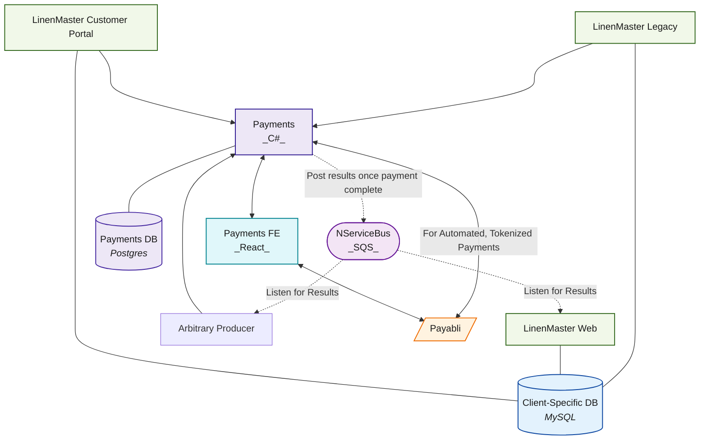

# C# Payments

## Dependencies

### Required Software
- **Docker Desktop** - Required for running the application containers

### Windows Installation Script
Run the following PowerShell script as Administrator to install dependencies:

**To run PowerShell as Administrator:**
1. Press `Windows + X` and select "Windows PowerShell (Admin)" or "Terminal (Admin)"
2. Or search for "PowerShell" in Start menu, right-click and select "Run as administrator"

```powershell
Set-ExecutionPolicy -ExecutionPolicy Unrestricted -Force
$ChocoPackages = @(
    "wsl2",
    "docker-desktop"
)
 
$ChocoInstall = Join-Path ([System.Environment]::GetFolderPath("CommonApplicationData")) "Chocolatey\bin\choco.exe"
 
if(!(Test-Path $ChocoInstall)) {
     try {
 
         Invoke-Expression ((New-Object net.webclient).DownloadString("https://chocolatey.org/install.ps1")) -ErrorAction Stop
     }
     catch {
         Throw "Failed to install Chocolatey"
     }       
}
 
foreach($Package in $ChocoPackages) {
     try {
         Invoke-Expression "cmd.exe /c $ChocoInstall Install $Package -y" -ErrorAction Stop
     }
     catch {
         Throw "Failed to install $Package"
     }
}
```

## System Design


## DB Design
erDiagram
    Biller ||--o{ Invoice : creates
    Biller ||--o{ Customer : belongs_to
    Customer ||--o{ Invoice : receives
    Invoice ||--|{ InvoiceLineItem : contains
    Invoice ||--o{ Payment : has
    PaymentMethod ||--o{ Payment : used_for
    Customer ||--o{ PaymentMethod : owns
    User }o--|| Customer : belongs_to
    PaymentMethod }o--|| User : optionally_owned_by
    Customer }o--|| PaymentGateway : uses

    Biller {
        long Id
        Guid PublicId
        string Name
        string ApiKey
        DateTime CreatedAt
        DateTime UpdatedAt
    }

    Customer {
        long Id
        Guid PublicId
        long BillerId
        long PaymentGatewayId
        string Name
        bool AutopayEnabled
        DateTime CreatedAt
        DateTime UpdatedAt
    }

    Invoice {
        long Id
        Guid PublicId
        long BillerId
        long CustomerId
        DateTime DueDate
        JsonDocument Fees
        bool PassThruFees
        decimal SalesTax
        decimal TotalAmount
        string Currency
        string Status
        DateTime CreatedAt
        DateTime UpdatedAt
    }

    InvoiceLineItem {
        long Id
        long InvoiceId
        string Description
        int Quantity
        decimal UnitPrice
        DateTime CreatedAt
        DateTime UpdatedAt
    }

    InvoiceLog {
        string Object
        int ObjectId
        JsonDocument Changes
        DateTime CreatedAt
    }

    PaymentMethod {
        long Id
        Guid PublicId
        long CustomerId
        long OwnerUserId
        string Token
        string Type
        string Last4
        string Brand
        DateTime ExpiryDate
        bool IsShared
        DateTime CreatedAt
        DateTime UpdatedAt
    }

    Payment {
        long Id
        Guid PublicId
        long InvoiceId
        long PaymentMethodId
        string Status
        int AttemptCount
        decimal Amount
        string TransactionReference
        DateTime CreatedAt
        DateTime UpdatedAt
    }

    User {
        long Id
        Guid PublicId
        long CustomerId
        string Email
        string Name
        DateTime CreatedAt
        DateTime UpdatedAt
    }

    PaymentGateway {
        long Id
        string Name
        string Type
        DateTime CreatedAt
        DateTime UpdatedAt
    }

